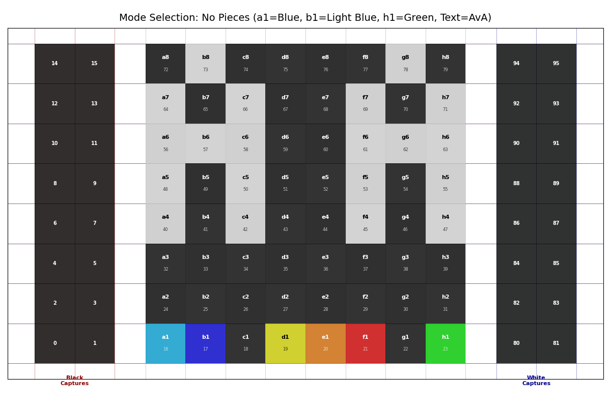
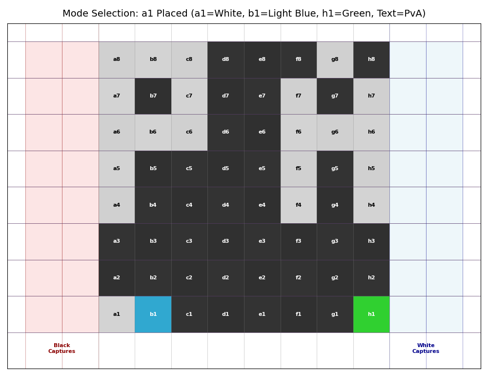
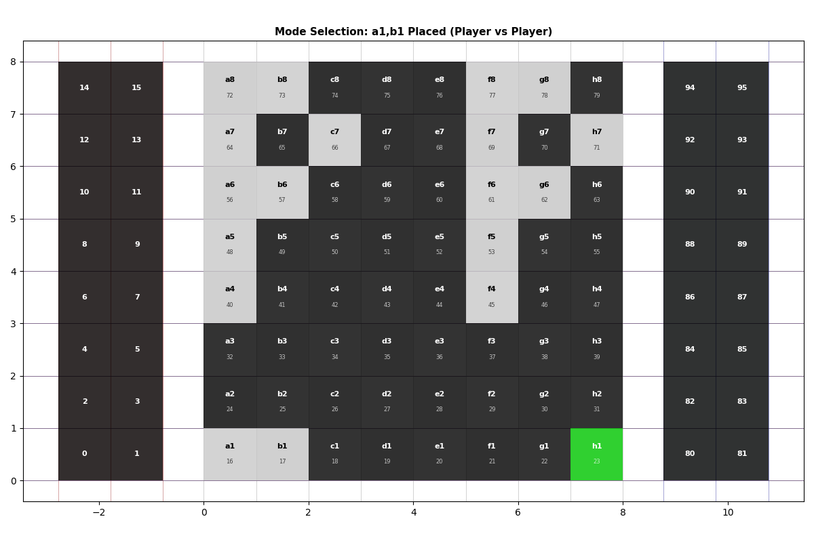
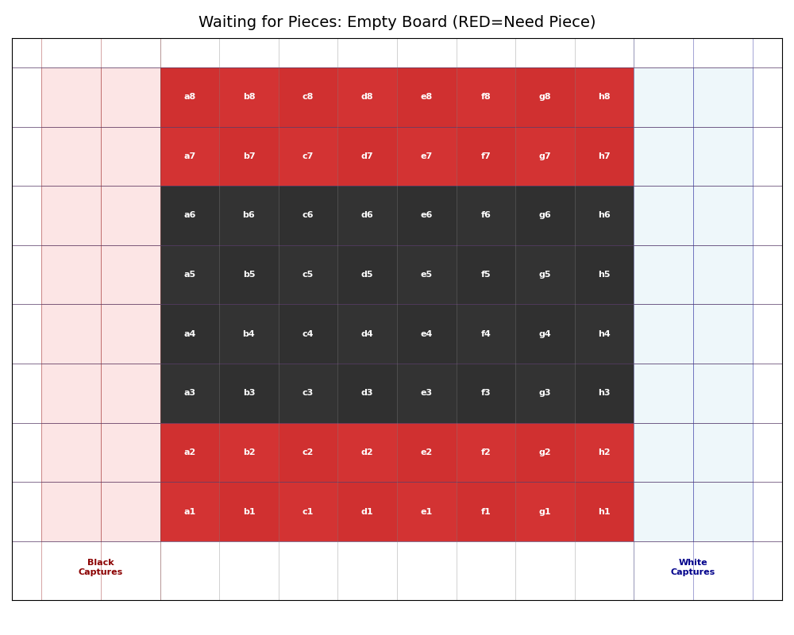
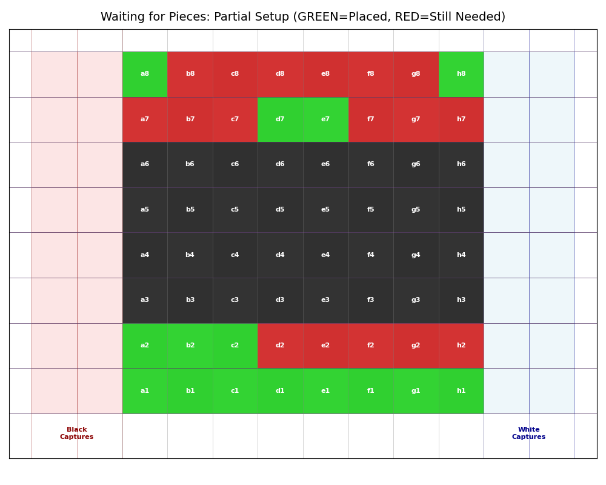
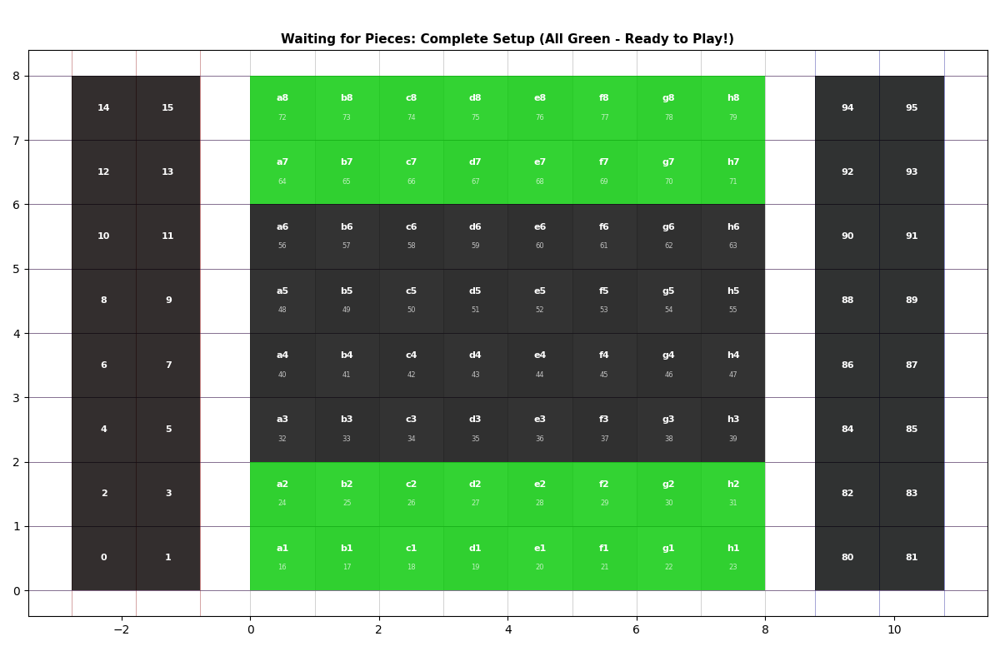

# Auto Chess Backend - XY Carriage Motor Controller

Control stepper motors to move an electromagnet under a chess board for automatic piece movement.
Inspired by the [Automated-Chessboard project](https://www.instructables.com/Automated-Chessboard/)

## Overview

This project uses a Raspberry Pi Zero 2W to control two NEMA stepper motors (X and Y axes) via TMC2208 drivers. The system supports homing to limit switches, absolute positioning, and relative movement.

## Hardware Requirements

- **Raspberry Pi Zero 2W** - Main controller
- **2× NEMA stepper motors** - For X and Y axes
- **2× TMC2208 stepper drivers** - Motor controllers (standalone mode)
- **Limit switches** - For homing on each axis
- **Electromagnet** - P20/15 24V 3kg (with MOSFET or relay module)
- **MOSFET** - IRLZ44N or similar logic-level MOSFET, or 5V relay module
- **Diode** - 1N5408 (3A, 1000V) flyback protection
- **Power supply** - 24V 2A+ rated for motors, electromagnet, and Pi
- **Resistors** - 4.7kΩ pulldown resistors for step pins (optional), 10kΩ for MOSFET gate
- **96× Reed switches** - 2×14mm N/O (Normally Open) magnetic switches for piece detection (64 main board + 32 capture areas)
- **6× CD74HC4067** - 16-channel analog/digital multiplexers for reading reed switches (96 squares ÷ 16 = 6)
- **96× Pull-down resistors** - 10kΩ resistors for reed switch inputs (optional - can use Pi internal pull-downs)
- **96× WS2812B LEDs** - Individually addressable RGB LEDs (5050 SMD, 5V, 0.24W each) for square illumination (64 main + 32 capture)

### Power Supply Options

The system requires power for:
- Raspberry Pi Zero 2W: ~1-2W (5V @ 0.2-0.4A)
- 2× NEMA steppers: ~12W (24V @ 0.5A)
- Electromagnet: ~7-19W (24V @ 0.3-0.8A)
- 96× WS2812B LEDs: ~23W max at full white (5V @ 4.6A), typical usage 5-8W

**Total: ~40-55W typical, ~80W maximum**

#### Option 1: USB-C PD (Power Delivery) - Modern & Elegant

USB-C PD can provide up to 100W (20V @ 5A) using modern phone/laptop chargers.

**Pros**:
- Single cable solution
- Common chargers (65W laptop chargers work great)
- Clean, modern interface
- Voltage negotiation built-in

**Cons**:
- Requires USB-C PD trigger board (~$5-10)
- More complex wiring
- Need to step down 20V to 24V, 5V, and 3.3V

**Recommended Components**:
- **USB-C PD Trigger Board**: Search "USB-C PD trigger 20V" - boards that negotiate voltage automatically
  - Example: IP2721/IP2716 based boards
  - Set to request 20V (some support 9V, 12V, 15V, 20V selection)
- **Buck Converters**:
  - 20V → 24V boost converter (or use 20V directly for motors if acceptable)
  - 20V/24V → 5V buck converter (5A rated) for WS2812B LEDs
  - 5V → 3.3V linear regulator or buck converter for Pi
- **USB-C Charger**: 65W+ laptop charger (20V @ 3.25A)

**Wiring**:
```
USB-C Charger (65W+, 20V) 
  ↓
USB-C PD Trigger Board (configured for 20V)
  ↓
  ├─→ Motors & Electromagnet (20-24V)
  ├─→ Buck Converter (20V → 5V @ 5A) → WS2812B LEDs
  └─→ Buck Converter (20V → 5V @ 2A) → Pi (via GPIO or USB)
```

#### Option 2: Standard 24V Brick Power Supply - Simple & Reliable

Traditional approach using a 24V wall adapter.

**Pros**:
- Simple, proven design
- Direct 24V for motors
- Fewer conversion stages
- Easier to troubleshoot

**Cons**:
- Bulkier power brick
- Less elegant than USB-C

**Recommended**:
- **24V 3A (72W) power supply** with barrel jack
- **Buck Converters**:
  - 24V → 5V @ 5A for WS2812B LEDs
  - 24V → 5V @ 2A for Raspberry Pi

**Wiring**:
```
24V Power Supply (3A, 72W)
  ↓
  ├─→ Motors & Electromagnet (24V direct)
  ├─→ Buck Converter (24V → 5V @ 5A) → WS2812B LEDs
  └─→ Buck Converter (24V → 5V @ 2A) → Pi (via GPIO pins or micro-USB)
```

**Recommendation**: For prototyping, **Option 2 (24V brick)** is simpler. For final build, **Option 1 (USB-C PD)** is more elegant and uses common laptop chargers.

**⚠️ Important**: Always use proper fusing and ensure common ground between all power supplies and the Raspberry Pi.

## Hardware Connections

### GPIO Pins

| Function | GPIO Pin |
|----------|----------|
| Motor X - Step | GPIO 17 |
| Motor X - Direction | GPIO 15 |
| Motor X - Enable | GPIO 5 |
| Motor Y - Step | GPIO 27 |
| Motor Y - Direction | GPIO 22 |
| Motor Y - Enable | GPIO 6 |
| Motor X - Home Switch | GPIO 23 |
| Motor Y - Home Switch | GPIO 24 |
| Electromagnet Control | GPIO 25 |

### WS2812B LED Strip Pins

For visual feedback using 64 individually addressable RGB LEDs:

| Function | GPIO Pin | Notes |
|----------|----------|-------|
| LED Data Signal | GPIO 18 (PWM0) | Hardware PWM for precise timing |
| LED Power (5V) | External 5V supply | From buck converter (5A rated) |
| LED Ground | GND | Common with Pi GND |

**Important**: GPIO 18 supports hardware PWM (PWM0) which is required for reliable WS2812B communication.

### Reed Switch Multiplexer Pins

For piece detection using 96 reed switches (64 main board + 32 capture areas) connected via 6× CD74HC4067 multiplexers:

| Function | GPIO Pin |
|----------|----------|
| Mux Address S0 | GPIO 12 |
| Mux Address S1 | GPIO 16 |
| Mux Address S2 | GPIO 20 |
| Mux Address S3 | GPIO 21 |
| Mux 1 Signal (a1-h1, a2-h2) | GPIO 13 |
| Mux 2 Signal (a3-h3, a4-h4) | GPIO 19 |
| Mux 3 Signal (a5-h5, a6-h6) | GPIO 26 |
| Mux 4 Signal (a7-h7, a8-h8) | GPIO 4 |
| Mux 5 Signal (left capture L1-L16) | GPIO 14 |
| Mux 6 Signal (right capture R1-R16) | GPIO 11 |

**Note**: You need **6 multiplexers** to cover all 96 squares. Each CD74HC4067 handles 16 channels:
- **Muxes 1-4**: Main chess board (64 squares)
- **Mux 5**: Left capture area (16 squares, 2×8)
- **Mux 6**: Right capture area (16 squares, 2×8)

Configure limit switches with pullup resistors to GPIO pins. The system detects home position when the pin reads LOW.

### Electromagnet Wiring

**Electromagnet Specs**: P20/15 (20mm diameter, 15mm height), 24V, 3kg holding force, ~0.3-0.8A

**Option 1: MOSFET Module (Recommended for 24V)**
```
GPIO 25 → 10kΩ resistor → MOSFET Gate (IRLZ44N or similar logic-level MOSFET)
MOSFET Drain → Electromagnet (-)
MOSFET Source → GND
Electromagnet (+) → 24V power supply (+)
24V power supply (-) → GND (common with Pi GND)
1N5408 flyback diode across electromagnet (cathode to +, anode to -)
```

**Option 2: 5V Relay Module (Easiest)**
```
GPIO 25 → Relay Module IN
Relay Module VCC → 5V from Pi
Relay Module GND → GND
Relay COM → 24V power supply (+)
Relay NO → Electromagnet (+)
Electromagnet (-) → 24V power supply (-)
1N5408 flyback diode across electromagnet (cathode to +, anode to -)
```

**Parts List**:
- **MOSFET**: IRLZ44N (logic-level, 50V, 30A) or equivalent
- **Diode**: 1N5408 (3A, 1000V) for flyback protection
- **Resistor**: 10kΩ for MOSFET gate
- **Power Supply**: 24V 2A+ (for electromagnet + stepper motors)

**Critical**: The 1N5408 diode **must** be placed directly across the electromagnet coil (cathode/stripe to +, anode to -) to protect against inductive voltage spikes when switching off.

### Reed Switch Multiplexer Wiring

Each square (including capture areas) has a reed switch underneath that closes when a magnetic chess piece is placed on top.

**CD74HC4067 Multiplexer Connections**:
```
CD74HC4067 → Raspberry Pi / Reed Switches
  VCC  → 3.3V (logic power from Pi - MUST be 3.3V, NOT 5V!)
  GND  → GND
  SIG  → GPIO (13, 19, 26, 4, 14, or 11 depending on multiplexer)
  S0   → GPIO 12 (shared across all 6 multiplexers)
  S1   → GPIO 16 (shared across all 6 multiplexers)
  S2   → GPIO 20 (shared across all 6 multiplexers)
  S3   → GPIO 21 (shared across all 6 multiplexers)
  EN   → GND (always enabled)
  C0-C15 → Reed switches (one side to channel, other side to 3.3V)
```

**⚠️ CRITICAL: Use 3.3V, NOT 5V!**
- Raspberry Pi GPIO pins are **NOT 5V tolerant**
- Using 5V will **damage or destroy your Pi**
- Always use 3.3V from Pi pin 1 or pin 17

**Reed Switch Wiring (per switch)**:
```
3.3V (Pi pin 1/17) → Reed Switch (one terminal)
Reed Switch (other terminal) → CD74HC4067 channel (C0-C15)

Optional: 10kΩ resistor from channel to GND (pull-down)
Note: External resistors not required - Pi has internal pull-downs enabled in software
```

**Square to Multiplexer Mapping**:
- **Mux 1 (GPIO 13)**: Squares a1-h1 (channels 0-7), a2-h2 (channels 8-15)
- **Mux 2 (GPIO 19)**: Squares a3-h3 (channels 0-7), a4-h4 (channels 8-15)
- **Mux 3 (GPIO 26)**: Squares a5-h5 (channels 0-7), a6-h6 (channels 8-15)
- **Mux 4 (GPIO 4)**: Squares a7-h7 (channels 0-7), a8-h8 (channels 8-15)
- **Mux 5 (GPIO 14)**: Left capture area L1-L16 (2 columns × 8 rows)
- **Mux 6 (GPIO 11)**: Right capture area R1-R16 (2 columns × 8 rows)

**How it works**:
1. The 4 address pins (S0-S3) select which of the 16 channels to read (shared across all muxes)
2. Each multiplexer's SIG pin is read individually to get that square's state
3. System scans all 96 squares sequentially by iterating through 0-15 on address pins
4. When a magnetic piece is on a square, the reed switch closes, pulling the channel HIGH
5. Can detect piece placement, removal, and track all moves (including captures)

### WS2812B LED Strip Wiring

Each square (main board + capture areas) has one WS2812B RGB LED (5050 SMD) for visual feedback.

**WS2812B Specifications**:
- Voltage: 5V DC
- Power: 0.24W per LED (60mA max at full white)
- Total: 96 LEDs × 0.24W = **23.04W max** (4.6A @ 5V at full brightness)
- Typical usage: 5-8W (lower brightness, not all white)
- Protocol: Single-wire data (800kHz timing, requires hardware PWM)

**Wiring Topology: Three-Section Architecture**

The 96 LEDs are organized in three independent physical sections with a single continuous data chain:

```
Buck Converter (5V)
  ├─→ 22AWG power wire → Black Captures section (LEDs 0-15)
  ├─→ 22AWG power wire → Main Board section (LEDs 16-79)
  └─→ 22AWG power wire → White Captures section (LEDs 80-95)

Data Chain (single GPIO 18, thin 30AWG wire between sections):
Pi GPIO 18 (PWM0) → 470Ω resistor → Black Captures LED 0 Din
Black Captures LED 15 Dout → 30AWG → Main Board LED 16 Din
Main Board LED 79 Dout → 30AWG → White Captures LED 80 Din
White Captures LED 95 Dout → (end of chain)

Each Section Internally (30AWG inter-LED segments):
  LED N Dout → LED N+1 Din (3cm maximum)

Ground (common):
  All sections → Pi GND (common ground rail)
```

**LED Index Mapping** (96 total LEDs):
```
Left Capture (LEDs 0-15):     Main Board (LEDs 16-79):        Right Capture (LEDs 80-95):
 0   1  (row 8, cols -2,-1)   Row 8:  16 17 ... 23  (a8-h8)    80 81  (row 8, cols 8,9)
 2   3  (row 7, cols -2,-1)   Row 7:  24 25 ... 31  (a7-h7)    82 83  (row 7, cols 8,9)
 4   5  (row 6)               Row 6:  32 33 ... 39  (a6-h6)    84 85  (row 6)
 6   7  (row 5)               Row 5:  40 41 ... 47  (a5-h5)    86 87  (row 5)
 8   9  (row 4)               Row 4:  48 49 ... 55  (a4-h4)    88 89  (row 4)
10  11  (row 3)               Row 3:  56 57 ... 63  (a3-h3)    90 91  (row 3)
12  13  (row 2)               Row 2:  64 65 ... 71  (a2-h2)    92 93  (row 2)
14  15  (row 1, cols -2,-1)   Row 1:  72 73 ... 79  (a1-h1)    94 95  (row 1, cols 8,9)
```

**Physical Installation**:
1. Mount one WS2812B LED in the top-right corner of each square (including capture areas)
2. Organize LEDs into three physical sections:
   - **Section 1**: Black captures (LEDs 0-15, 16 total)
   - **Section 2**: Main board (LEDs 16-79, 64 total)
   - **Section 3**: White captures (LEDs 80-95, 16 total)
3. Wire data connections:
   - Use **470Ω resistor** on data line (between Pi GPIO 18 and first LED) to reduce ringing
   - Use **30AWG thin wire** for:
     * Inter-LED connections within each section (3cm max per segment)
     * Section-to-section data connections (between Dout and Din)
4. Wire power connections:
   - Use **22AWG thick wire** from buck converter to each section:
     * One 22AWG wire → Black Captures section LED 0 (5V/GND)
     * One 22AWG wire → Main Board section LED 16 (5V/GND)
     * One 22AWG wire → White Captures section LED 80 (5V/GND)
   - Use **30AWG thin wire** for inter-LED power within each section
5. Add **1000µF capacitor** across 5V and GND near buck converter output for power stability
6. Ensure common ground: All sections share Pi GND rail

**Advantages of Three-Section Topology**:
- **Prevents voltage drop accumulation**: Each section independently powered from buck converter
- **Tight space friendly**: Thin 30AWG wires for inter-LED segments (only 0.02V drop per 3cm)
- **Single GPIO control**: One data line controls all 96 LEDs via daisy-chain
- **Scalable power**: Easy to add additional thick-wire injections if needed for future expansion

**Critical Timing**:
- WS2812B requires precise 800kHz timing (1.25µs periods)
- **Must use GPIO 18 (hardware PWM)** - software bit-banging is unreliable
- `rpi_ws281x` library handles timing automatically

### LED Mode Selection & Setup Feedback

The system uses LEDs to provide interactive visual feedback during setup:

**Interactive Mode Selection** - Place pieces to select and confirm game mode:
- **No pieces**: AI vs AI mode ready (displays "AA")
- **Place piece on a1**: Player vs AI mode ready - Player plays WHITE (displays "PA")
- **Place piece on b1**: Player vs AI mode ready - Player plays BLACK (displays "AP")
- **Place pieces on both a1 and b1**: Player vs Player mode ready (displays "PP")
- **Place piece on h1**: Confirm and START game in selected mode
- Button squares:
  - a1: Light blue button (turns white when piece placed)
  - b1: Blue button (turns white when piece placed)
  - h1: Green confirmation button (turns white to start game)
- Board displays current mode text (AA/PA/AP/PP) in white LEDs





**Piece Placement Feedback** - Visual guidance for setting up starting position:
- **RED** - Empty squares that need pieces
- **GREEN** - Correctly placed pieces
- Provides clear visual confirmation during setup





### TMC2208 Stepper Driver Configuration

**Connection (Standalone Mode)**:
```
TMC2208 → Raspberry Pi / Motor
  VDD  → 3.3V or 5V (logic power)
  GND  → GND
  STEP → GPIO (17 for X, 27 for Y)
  DIR  → GPIO (18 for X, 22 for Y)
  EN   → GPIO (5 for X, 6 for Y) - LOW=enabled, HIGH=disabled
  VM   → Motor power supply (12-24V)
  GND  → Motor power GND
  A1, A2, B1, B2 → Stepper motor coils
```

**Microstepping Configuration (MS1/MS2 Pins)**:

For **quiet operation with 16× microstepping** (recommended):

| MS1 | MS2 | Microstepping | Interpolation | Steps/Revolution (1.8° motor) |
|-----|-----|---------------|---------------|-------------------------------|
| VDD | VDD | 1/16          | 1/256         | 3200                          |

Other microstepping options (all with 1/256 interpolation in stealthChop2):

| MS1 | MS2 | Microstepping | Steps/Revolution |
|-----|-----|---------------|------------------|
| GND | GND | 1/8           | 1600             |
| GND | VDD | 1/2           | 400              |
| VDD | GND | 1/4           | 800              |

**StealthChop (Silent Operation)**:
- **Enabled by default** in standalone mode
- Active when step frequency < ~35,000 steps/second
- Current config (STEP_DELAY=0.002s → 500 Hz) keeps StealthChop active ✓
- No UART connection needed for basic StealthChop
- Provides extremely quiet operation ideal for chess piece movement

**Physical Setup**:
1. Add small heatsink to TMC2208 chip
2. Set MS1=VDD, MS2=VDD for 16× microstepping (solder jumpers or via pins)
3. Adjust motor current via VREF potentiometer:
   - VREF = Motor_Current × 0.5 (for standalone mode)
   - Example: For 1A motor, set VREF to 0.5V
4. Use multimeter to measure VREF on the potentiometer

**Wiring for Common Ground**:
- TMC2208 GND, Motor PSU GND, and Raspberry Pi GND **must** be connected together

## Installation

### Setup Python Environment

```bash
# Initialize project (already done)
cd ~/workspace/auto-chess-backend
uv sync

# Activate virtual environment
source .venv/bin/activate
```

### Install Dependencies

```bash
# Install production dependencies (including pigpio)
uv sync

# Install development dependencies (ruff, mypy)
uv sync --extra dev
```

### Setup pigpio Daemon (Recommended for Better Performance)

The pigpio daemon provides hardware-timed step generation for much better speed and precision:

```bash
# On the Raspberry Pi, run the setup script
./setup-pigpio.sh
```

This will:
- Install the pigpio package
- Enable pigpiod service to start on boot
- Start the daemon immediately

**Benefits of pigpio**:
- **5-10× faster** movement speed (microsecond timing vs ~1ms software limit)
- **Smoother motion** with precise timing
- **Higher step rates** possible (several kHz vs ~1 kHz max with time.sleep)
- **No code changes** - automatically used when available

**Fallback**: If pigpio is not available, the system automatically falls back to software timing with `time.sleep()`.

## Configuration

Edit [src/config.py](src/config.py) to customize:

**GPIO Pins**:
- `MOTOR_X_STEP_PIN`, `MOTOR_X_DIR_PIN`, `MOTOR_Y_STEP_PIN`, `MOTOR_Y_DIR_PIN`
- `MOTOR_X_HOME_PIN`, `MOTOR_Y_HOME_PIN`, `ELECTROMAGNET_PIN`

**Chess Board Configuration**:
- `SQUARE_SIZE_MM` - Size of each chess square in millimeters (default: 31mm)
- `BOARD_ROWS`, `BOARD_COLS` - Board dimensions (default: 8×8 for standard chess)
- `STEPS_PER_MM` - Motor steps per millimeter (calibrate based on your setup)
- `BOARD_WIDTH_STEPS`, `BOARD_HEIGHT_STEPS` - Auto-calculated board dimensions

**Motor Settings**:
- `MOTOR_X_INVERT`, `MOTOR_Y_INVERT` - Set to `True` if motor spins opposite direction
- `MAX_X_POSITION`, `MAX_Y_POSITION` - Auto-sized to fit board + margin
- `STEP_DELAY` - Base delay between steps (used when acceleration disabled)

**Acceleration Settings** ✨:
- `ENABLE_ACCELERATION` - Enable trapezoidal acceleration profile (`True` recommended)
- `USE_PIGPIO` - Use hardware-timed step generation via pigpio daemon (`True` recommended)
- `MIN_STEP_DELAY` - Minimum delay (maximum speed) - default `0.000125s` = 8000 steps/second
- `MAX_STEP_DELAY` - Maximum delay (starting/ending speed) - default `0.002s` = 500 steps/second
- `ACCELERATION_STEPS` - Number of steps for ramp up/down - default `200` steps

**Hardware-Timed Step Generation (pigpio)**:
- **Recommended**: Enables microsecond-precision timing (vs ~1ms limit with `time.sleep()`)
- **Speed improvement**: 5-10× faster than software timing
- **Setup**: Run `./setup-pigpio.sh` on the Pi to install and enable pigpiod daemon
- **Fallback**: Automatically falls back to software timing if pigpio unavailable

**Homing**:
- `HOME_DIRECTION_X`, `HOME_DIRECTION_Y` - Direction to move during homing (0 or 1)
- `HOME_STEP_DELAY` - Slower speed for safe homing

**Electromagnet**:
- `ELECTROMAGNET_ACTIVE_HIGH` - `True` for NPN transistor/MOSFET, `False` for active-low relay

**Reed Switch Configuration**:
- `MUX_S0_PIN`, `MUX_S1_PIN`, `MUX_S2_PIN`, `MUX_S3_PIN` - Multiplexer address pins (shared)
- `MUX_SIG_PINS` - List of 4 signal pins, one per multiplexer
- `REED_SWITCH_SCAN_RATE` - Scans per second (10-50 Hz recommended)
- `REED_SWITCH_DEBOUNCE_TIME` - Debounce time in seconds (0.1s default)
- `MOVE_DETECTION_TIMEOUT` - Max time to wait for move completion (30s default)

**Acceleration Benefits**:
- **Prevents missed steps** by starting slow
- **Smoother movement** with gradual speed changes
- **Reduced mechanical stress** on motors and carriage
- **Quieter operation** with less vibration
- **Faster overall** due to higher maximum speed (8000 steps/s with pigpio vs 1000 steps/s software)
- **Precise timing** with pigpio hardware-timed waves (microsecond resolution)

## Usage

### Command Line Interface

```bash
# Home all motors (must do this first!)
python src/main.py home

# Demo mode - Execute calibration patterns (automatically homes first)
python src/main.py demo                    # Run all patterns (square, diagonals, snake)
python src/main.py demo --pattern square   # Just the board perimeter
python src/main.py demo --pattern diagonals # Just the 4 major diagonals
python src/main.py demo --pattern snake    # Just the snake pattern (all 64 squares)
python src/main.py demo --no-home          # Skip auto-homing if already homed

# Move to absolute position (in steps)
python src/main.py move 1000 2000

# Move relative to current position
python src/main.py move-rel --dx 100 --dy -50

# Chess board navigation (via Python API)
from board_navigation import square_to_steps, chess_notation_to_steps
from motor_controller import MotorController

# Move to e4 square using chess notation
x, y = chess_notation_to_steps('e4')
controller.move_to(x, y)

# Or use row/column (0-indexed, 0=bottom-left)
x, y = square_to_steps(row=3, col=4)  # Same as e4
controller.move_to(x, y)

# Electromagnet control
python src/main.py magnet-on       # Turn magnet on
python src/main.py magnet-off      # Turn magnet off
python src/main.py magnet-toggle   # Toggle magnet state

# Motor control
python src/main.py motor-enable    # Enable motors (allows movement)
python src/main.py motor-disable   # Disable motors (saves power, manual movement allowed)

# Reed switch commands (piece detection)
python src/main.py reed-scan               # Single scan - show all occupied squares
python src/main.py reed-scan --continuous  # Continuous monitoring (Ctrl+C to stop)
python src/main.py reed-wait-move          # Wait for human player to make a move
python src/main.py reed-test e4            # Test a specific square's sensor

# Get current position
python src/main.py position

# Get detailed motor and magnet status
python src/main.py status

# Emergency stop (also turns off magnet)
python src/main.py stop
```

## Testing

### Board Navigation Tests

Run the test suite to validate chess board navigation and generate visualizations:

```bash
# Run all tests
pytest tests/test_board_navigation.py -v

# Run specific test
pytest tests/test_board_navigation.py::test_snake_pattern_all_squares -v
```

**Generated Visualizations** (in `tests/output/`):
- `edge_square.png` - Board perimeter movement
- `all_diagonals.png` - Four major diagonal paths
- `snake_pattern.png` - Complete 64-square coverage

**Test Coverage**:
- Board edge navigation
- Diagonal movements (all 4 directions)
- Snake pattern through all squares
- Configuration validation

### Interactive Mode

```bash
python src/main.py interactive

# Commands:
# home              - Home all motors
# pos               - Show current position
# move X Y          - Move to absolute position
# movex STEPS       - Move X axis relative
# movey STEPS       - Move Y axis relative
# magnet on         - Turn electromagnet on
# magnet off        - Turn electromagnet off
# magnet toggle     - Toggle electromagnet
# status            - Show motor and magnet status
# stop              - Emergency stop
# help              - Show help
# exit              - Exit
```

## API Usage

Use the motor controller directly in Python:

```python
from motor_controller import StepperMotor, MotorController
import config

# Create motors
motor_x = StepperMotor(
    step_pin=config.MOTOR_X_STEP_PIN,
    dir_pin=config.MOTOR_X_DIR_PIN,
    home_pin=config.MOTOR_X_HOME_PIN,
    invert_direction=config.MOTOR_X_INVERT,
    max_position=config.MAX_X_POSITION,
    step_delay=config.STEP_DELAY,
)

motor_y = StepperMotor(
    step_pin=config.MOTOR_Y_STEP_PIN,
    dir_pin=config.MOTOR_Y_DIR_PIN,
    home_pin=config.MOTOR_Y_HOME_PIN,
    invert_direction=config.MOTOR_Y_INVERT,
    max_position=config.MAX_Y_POSITION,
    step_delay=config.STEP_DELAY,
)

# Create controller
controller = MotorController(motor_x, motor_y)

# Home motors
controller.home_all(
    home_direction_x=config.HOME_DIRECTION_X,
    home_direction_y=config.HOME_DIRECTION_Y,
)

# Move to position
controller.move_to(x=1000, y=2000)

# Get position
x, y = controller.get_position()
print(f"Current position: X={x}, Y={y}")

# Get status
status = controller.get_status()

# Emergency stop
controller.emergency_stop()
```

### Reed Switch API

Use the reed switch controller to detect piece positions:

```python
from reed_switch_controller import ReedSwitchController

# Create controller
reed = ReedSwitchController()

# Scan all 96 squares (64 main board + 32 capture areas)
board_state = reed.scan_with_debounce()  # Returns list of 96 booleans

# Get list of occupied squares
occupied = reed.get_occupied_squares()  # Returns [(row, col), ...]

# Read specific square
is_occupied = reed.read_square(row=3, col=4)  # e4 square

# Detect changes since last scan
added, removed = reed.detect_changes()
for row, col in added:
    print(f"Piece added at {chr(97 + col)}{row + 1}")

# Wait for human player move
result = reed.wait_for_move(timeout=30.0)
if result:
    from_square, to_square = result
    print(f"Move: {from_square} -> {to_square}")

# Get visual board representation
print(reed.get_board_state_fen_like())

# Clean up
reed.close()
```

**Reed Switch Features**:
- **Automatic debouncing** to filter electrical noise
- **Real-time move detection** for human players
- **96-square coverage** using 6 multiplexers (main board + capture areas)
- **Fast scanning** up to 50 Hz
- **Visual board display** showing occupied squares

## Key Features

- **Homing**: Automatic homing to limit switches
- **Position Tracking**: Maintains current position state
- **Absolute & Relative Movement**: Move to exact positions or by step increments
- **Coordinated Motion**: Bresenham's algorithm ensures straight diagonal paths
- **Per-Motor Acceleration**: Each motor uses independent acceleration profiles for optimal speed
- **Diagonal Speed Optimization**: 30% faster diagonal movements while maintaining straight paths
- **Trapezoidal Velocity Profiles**: Smooth acceleration and deceleration
- **Direction Control**: Easily invert motor directions via configuration
- **Safety Limits**: Prevents movement beyond max positions
- **Capture Area Support**: Extended board with 2×8 capture areas on each side for captured pieces
- **Obstacle Avoidance**: Greedy local pathfinding navigates around pieces when moving to capture areas
- **Reed Switch Integration**: 96 magnetic sensors detect piece positions (64 main board + 32 capture areas)
- **Human Move Detection**: Automatically detects when players pick up and place pieces
- **Real-time Board Monitoring**: Continuous scanning with debouncing for reliable detection
- **LED Feedback**: 96 individually addressable RGB LEDs for visual feedback (main board + capture areas)
- **Error Handling**: Validates moves and provides detailed error messages
- **GPIO-free Simulation**: Works on non-Pi systems for development (limits switch not available)

## Project Structure

```
auto-chess-backend/
├── src/
│   ├── main.py                    # CLI interface
│   ├── config.py                  # Configuration constants
│   ├── board_navigation.py        # Chess coordinate conversion (with capture areas)
│   ├── piece_movement.py          # High-level piece movement with obstacle avoidance
│   ├── capture_management.py      # Capture area placement logic
│   ├── knight_pathfinding.py      # L-shaped knight movement
│   ├── demo_patterns.py           # Calibration patterns
│   ├── motor/
│   │   ├── motor_controller.py    # Motor coordination
│   │   ├── stepper_motor.py       # Individual motor control
│   │   └── electromagnet.py       # Magnet control
│   ├── led/
│   │   └── ws2812b_controller.py  # LED control and patterns (96 LEDs)
│   ├── reed_switch/
│   │   └── controller.py          # Reed switch multiplexer control (96 switches)
│   └── chess_game/
│       ├── game.py                # Chess rules and validation
│       ├── piece.py               # Piece types and representation
│       ├── player.py              # Player enum
│       └── square.py              # Square representation
├── tests/
│   ├── fixtures/                  # Test fixtures and utilities
│   ├── visualization/             # Board visualization utilities
│   └── output/                    # Generated test visualizations
│       ├── captures/              # Capture sequence visualizations
│       ├── movement/              # Movement path analysis
│       ├── chess/                 # Chess game visualizations
│       ├── leds/                  # LED pattern visualizations
│       └── reed_switches/         # Reed switch visualizations
├── analysis/                      # Performance analysis
├── README.md                      # This file
├── AGENTS.md                      # Development notes
└── pyproject.toml                 # Project metadata
```

## Development

### Code Quality Tools

```bash
# Format code with ruff
uv run ruff format .

# Lint code with ruff
uv run ruff check .

# Fix auto-fixable lint issues
uv run ruff check --fix .

# Type check with mypy
uv run mypy .

# Run all checks before committing
uv run ruff format . && uv run ruff check --fix . && uv run mypy .
```

## Testing Without Hardware

The system gracefully handles missing GPIO:

- On non-Pi systems, homing succeeds without activating limit switches
- Motor movements are simulated without actual hardware
- Perfect for development and testing logic

## Performance

- **Step frequency**: Configurable via `STEP_DELAY` (default 500 Hz)
- **Microstepping**: Set via TMC2208 MS pins (default 16×)
- **Position accuracy**: Limited by stepper resolution and mechanical setup

## Troubleshooting

### Motor moves wrong direction
- Set `MOTOR_X_INVERT = True` or `MOTOR_Y_INVERT = True` in config.py

### Homing never completes
- Verify GPIO pins in config match your hardware
- Check limit switch wiring and connectivity
- Ensure pullup resistors on limit switch pins

### Movements are jerky
- Increase `STEP_DELAY` slightly (slower = more stable)
- Check power supply voltage and amperage

## License

This project is part of the Auto Chess system.
