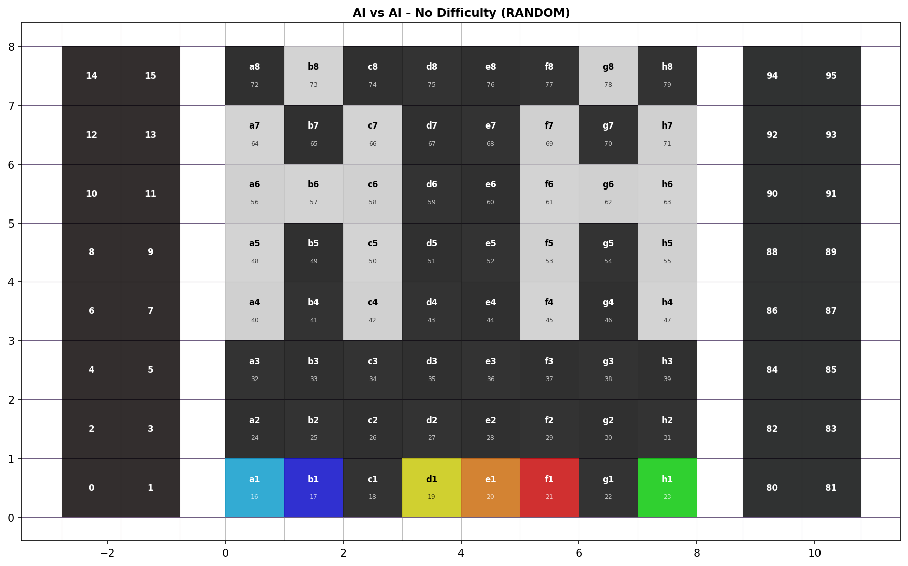
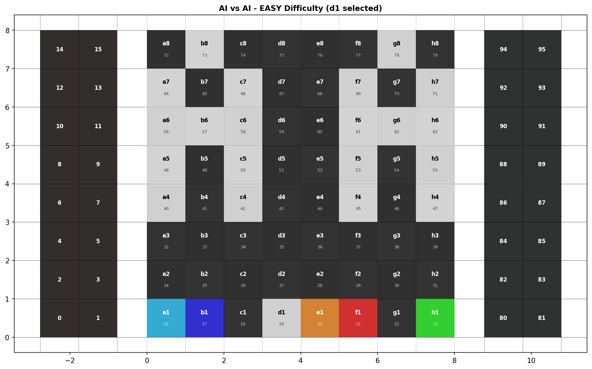
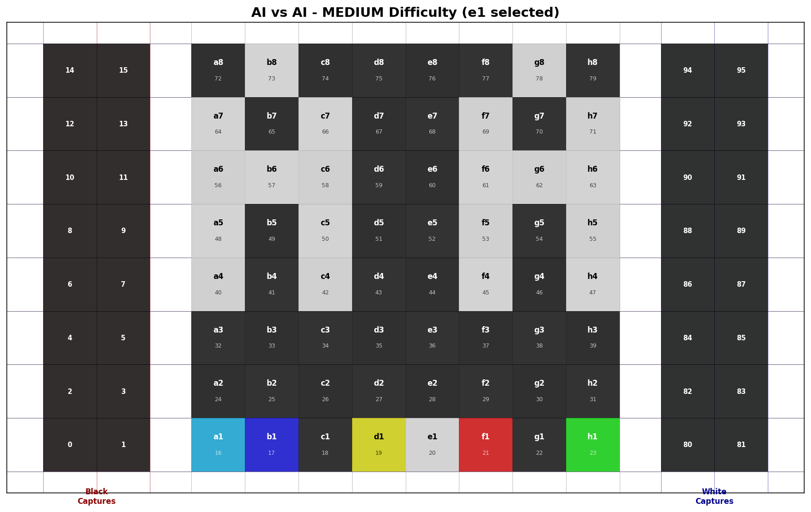
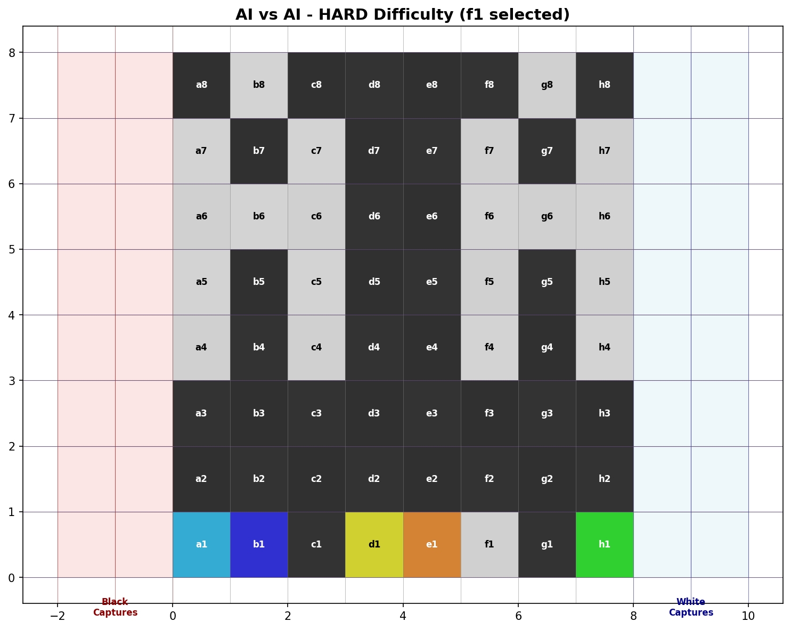
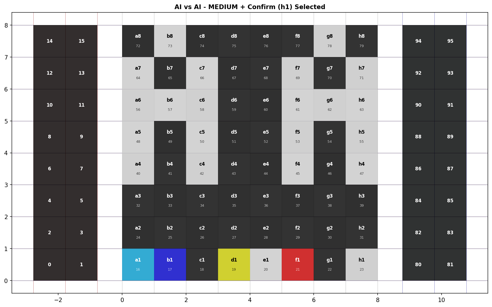
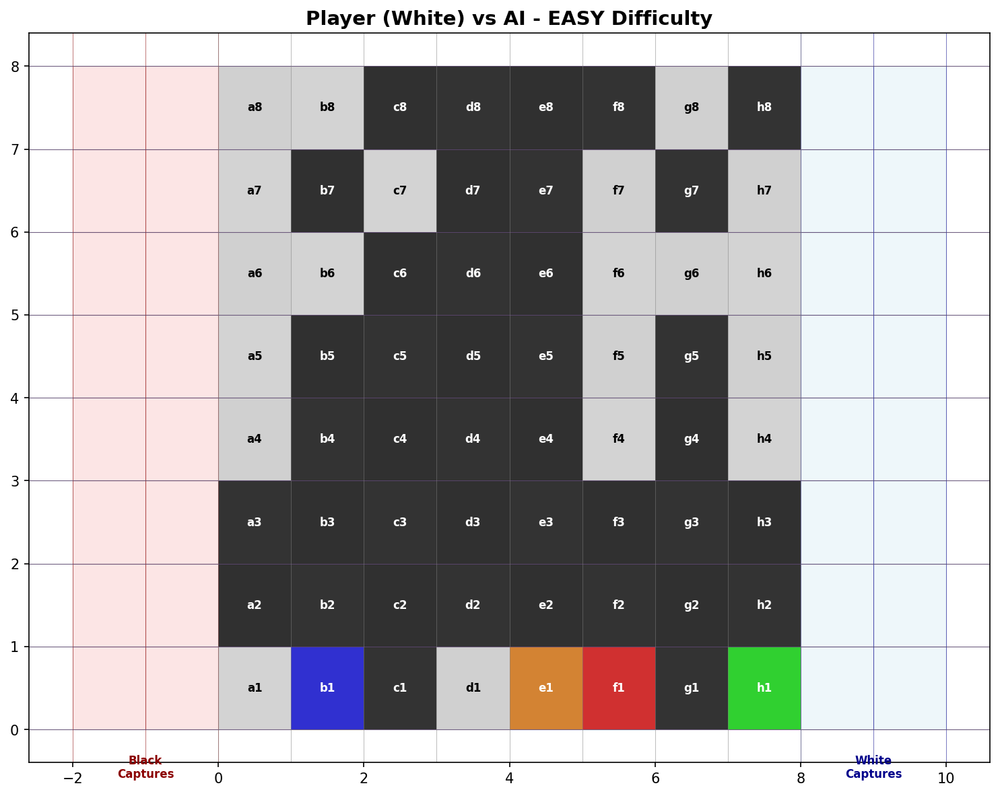
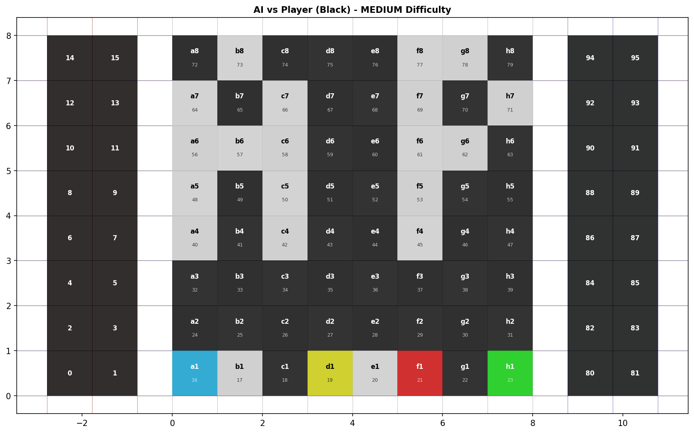
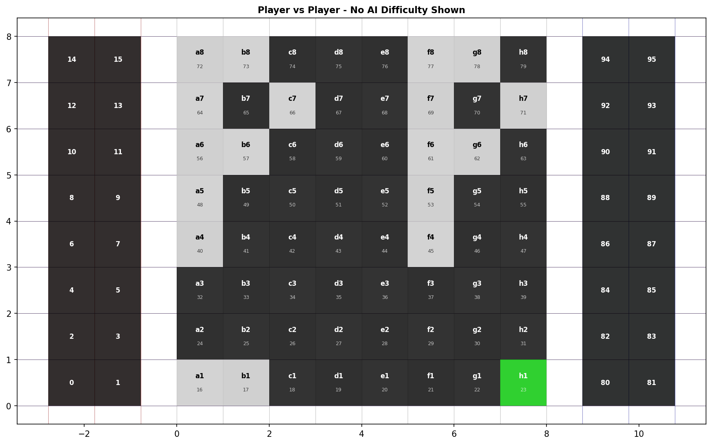

# AI Difficulty Selection - LED Mode Selection Integration

## Overview

Added AI difficulty selection to the mode selection screen using squares d1, e1, and f1. Difficulty buttons only appear when AI is involved in the game (AvA, PvA, or AvP modes), and are hidden during Player vs Player mode.

## Control Scheme

### Mode Selection Buttons (Row 0)
- **a1** (Light Blue): Player as WHITE
- **b1** (Blue): Player as BLACK  
- **d1** (Yellow): EASY difficulty
- **e1** (Orange): MEDIUM difficulty
- **f1** (Red): HARD difficulty
- **h1** (Green): Confirm selection

### Difficulty Mapping
- **No difficulty selected**: RANDOM
- **d1 selected**: EASY
- **e1 selected**: MEDIUM
- **f1 selected**: HARD

### Game Modes
- **No pieces (a1/b1)**: AI vs AI + difficulty selection
- **Only a1 placed**: Player (White) vs AI + difficulty selection
- **Only b1 placed**: AI vs Player (Black) + difficulty selection
- **Both a1+b1 placed**: Player vs Player (NO difficulty selection)

## Test Coverage

Added 16 comprehensive tests:
- 8 unit tests verifying difficulty button behavior
- 8 visualization tests generating PNG images

All 129 tests passing (113 existing + 16 new)

## Visualizations

### AI vs AI Mode

#### No Difficulty (RANDOM)

- Default difficulty when no d1/e1/f1 selected
- Shows "AA" text for AI vs AI mode
- Difficulty buttons: d1=yellow, e1=orange, f1=red

#### EASY Difficulty

- d1 selected (white)
- Other difficulty buttons remain colored

#### MEDIUM Difficulty

- e1 selected (white)
- Shows MEDIUM difficulty active

#### HARD Difficulty

- f1 selected (white)
- Highest difficulty level

#### With Confirm Button

- Both e1 and h1 selected
- Shows ready to start game

### Player vs AI Modes

#### Player (White) vs AI - EASY

- a1 selected (player as white)
- d1 selected (EASY difficulty)
- Shows "PA" text for Player vs AI

#### AI vs Player (Black) - MEDIUM

- b1 selected (player as black)
- e1 selected (MEDIUM difficulty)
- Shows "AP" text for AI vs Player

### Player vs Player Mode

#### No Difficulty Shown

- Both a1 and b1 selected
- Difficulty buttons (d1/e1/f1) are OFF
- Shows "PP" text for Player vs Player
- No AI involved, so no difficulty selection

## Implementation Details

### Conditional Difficulty Display
```python
# Check if AI is involved (any mode except PvP)
ai_involved = not (a1_placed and b1_placed)

if ai_involved:
    # Show difficulty buttons d1, e1, f1
    # Allow selection with white color when placed
```

### Priority System
If multiple difficulty squares are "placed" simultaneously:
- **f1 (HARD) > e1 (MEDIUM) > d1 (EASY)**
- Only the highest priority is shown as selected (white)
- Others remain in their default colors

### Color Scheme
- **d1 (EASY)**: Yellow (200, 200, 0) → White when selected
- **e1 (MEDIUM)**: Orange (200, 100, 0) → White when selected
- **f1 (HARD)**: Red (200, 0, 0) → White when selected

## Next Steps

The mode selection system is now complete with:
1. ✅ Game mode selection (AvA / PvA / AvP / PvP)
2. ✅ Player color selection (white/black for PvA modes)
3. ✅ AI difficulty selection (RANDOM / EASY / MEDIUM / HARD)
4. ✅ Confirm button (h1)

Ready to integrate with:
- Game orchestration layer
- Reed switch detection for piece placement
- Game flow controller
